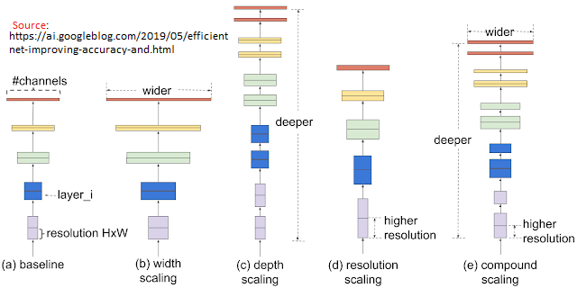

# Food-101 paper through EfficientNet lens

## Intro

EfficientNet (Hongkun Yu et al) is a model scaling method that uses a highly effective compound coefficient to scale up CNNs in a more structured manner. Rather than arbitrarily scale network dimensions, this method uniformly scales each dimension with a fixed set of scaling coefficients.

Food-101 is a dataset that consists of 101 food categories with 750 training and 250 test images per category. 

In "Food-101 – Mining Discriminative Components with Random Forests" [paper](https://data.vision.ee.ethz.ch/cvl/datasets_extra/food-101/static/bossard_eccv14_food-101.pdf), the authors(Lukas Bossard et al) used RF architecture to train a model to achieve an average accuracy of 50.76%. We will use this paper as a baseline to evaluate the performance of EfficientNet-B0 Architecture

---
## Tasks

* [x] **Transfer Learning**:
In the Food-101 paper, authors achieved an average accuracy of 50.76% using RF model. We need to explore the impact of utilizing EfficientNet to train our model. First, we'll use EfficientNet to build a feature extraction model. Then we will fine-tune this model. Finally, we will evaluate the created model to compare its performance to the model used in Food-101 paper.

* [x] **TFDS datasets**:
Instead of using Food-101 dataset from source, we will utilize TensorFlow Datasets (TFDS) API to load the data set. TFDS offers high performance input pipelines and includes a catalog of large collection of datasets. 

---
## License

This project is licensed under the GNU GPLv3 License

