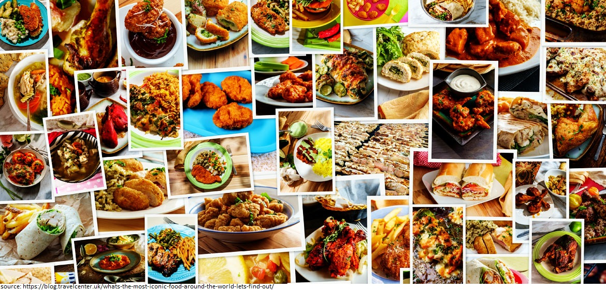

# DeepFood paper through EfficientNet lens

## Intro

EfficientNet (Hongkun Yu et al) is a model scaling method that uses a highly effective compound coefficient to scale up CNNs in a more structured manner. Rather than arbitrarily scale network dimensions, this method uniformly scales each dimension with a fixed set of scaling coefficients.

Food-101 is a dataset that consists of 101 food categories with 750 training and 250 test images per category. 

In "DeepFood" [paper](https://arxiv.org/ftp/arxiv/papers/1606/1606.05675.pdf), the authors(Chang Liu et al) trained a CNN based model to achieve a "Top-1 accuracy" of 77.4%. We will use this paper as a baseline to evaluate the performance of EfficientNet-B0 Architecture

---
## Goal
In the DeepFood paper, authors developed an algorithm that was able to achieved a "Top-1 accuracy" of 77.4%. We need to explore the impact of utilizing EfficientNet to train our model. We will build a model using EfficientNet. Then we will evaluate different metrics to compare the performance of EfficientNet vs the model proposed in DeepFood paper.

---
## Tasks
* [x] **TFDS datasets**:
Instead of using Food-101 dataset from source, we will utilize TensorFlow Datasets (TFDS) API to load the dataset. We will explore the features and labels. Then we will analyze and visualize samples from the dataset. 

* [x] **Building TF input pipeline**:
We will use tf.data API to build our input pipeline. 

* [x] **Mixed precision**:
We will enable mixed precision. Although it’s not supported in this case, we will benefit from memory utilization improvements because we’ve changed the policy to "mixed_float16". We’ll explore layers that was impacted by this policy change.

* [x] **Transfer Learning**:
First, we'll use EfficientNet to build a feature extraction model. Then we will build a fine-tuning model. Since we have sufficient number of images (750 images) per class, our fine-tuning strategy will be to unfreeze the whole base model. Then we’ll train both the head and baseline using food-101 dataset.

 * [x] **Evaluation- Tensorboard**:
To use Tensorboard to visualize accuracy plot to compare feature extraction vs fine-tuning models

* [x] **Evaluation- Confusion Matrix**:
To plot confusion matrix

* [x] **Evaluation- F1 Scores**:
To plot F1 scores for different classes

---
## Results

### Tensorboard

Our model exceeded the accuracy of DeepFood paper (80.16% vs 77.4%). However, the accuracy plot shows that our fine-tuning model is suffering from some over-fitting. This indicates that the model can achieve better results by: optimizing hyperparameters, using regularization/dropout and other optimization techniques. 

### Confusion Matrix

The above confusion matrix will give us insight into which classes our model is getting most "confused" on. We can see that our model is mainly confused between images like: steak and filet_mignon, apple_pie and bibimpab...etc. These are very similar classes and even human can be confused by these images. We can help minimize this problem by providing our model more images from these classes or apply more augmentation. 

### F1 Scores

F1 score is the harmonic mean of the precision and recall. It combines them into a single metric. Selecting appropriate metric will depend on the problem we are trying to deal with. Since we are currently not focusing on false positives or false negatives, we will use F1 score metric because it’s a good “overall” metric for our classification model. Using above plot will be easier to use to troubleshoot problematic classes than using confusion matrix shown previously. 

---
## License

This project is licensed under the GNU GPLv3 License

